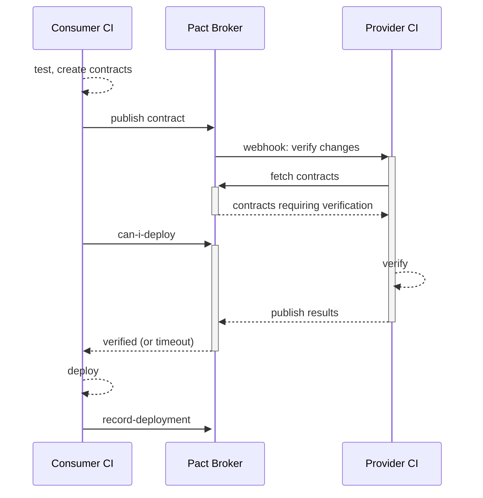
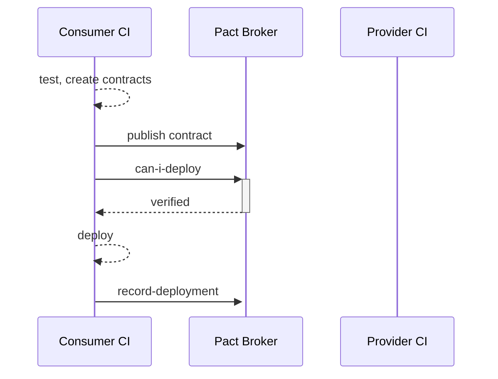
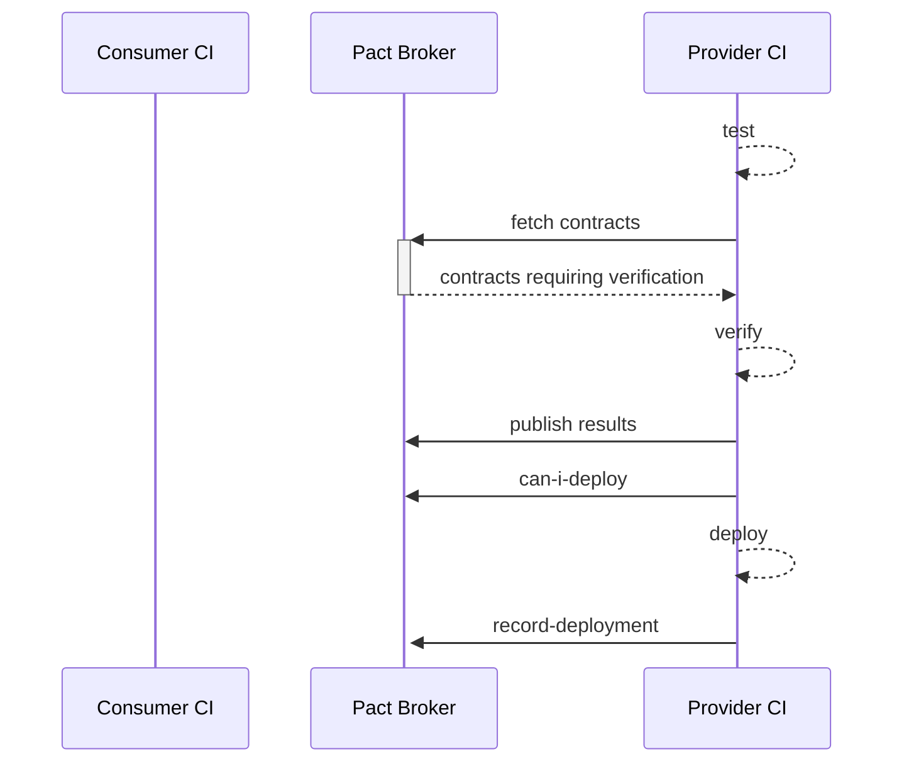
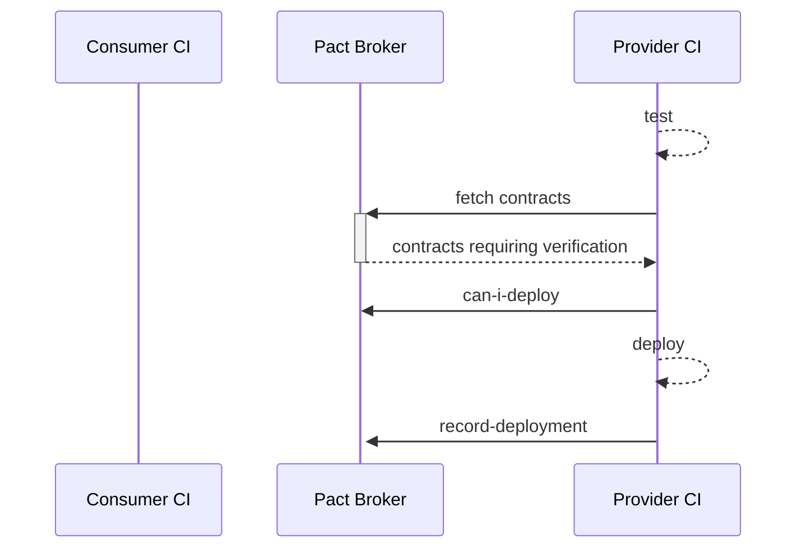

# pact-broker

Docs: https://docs.pact.io/pact_broker

- https://github.com/pact-foundation/pact_broker
- https://github.com/pact-foundation/pact_broker/wiki
- https://github.com/pact-foundation/pact_broker-client
- https://docs.pact.io/pact_broker/webhooks
- https://docs.pact.io/pact_broker/webhooks/template_library
- https://docs.pact.io/pact_broker/webhooks#example-cicd-and-webhook-configuration
- https://docs.pactflow.io/docs/workshops/ci-cd
- https://github.com/pact-foundation/pact-broker-docker

## Demos

- see [README-local.md](README-local.md) for a local setup 
- see [README-remote.md](README-remote.md) for a remote setup including webhooks

## Flows: Consumer

> with a changed contract

> without changed contracts

## Flows: Producer

> with a changed contract

> without changed contracts

